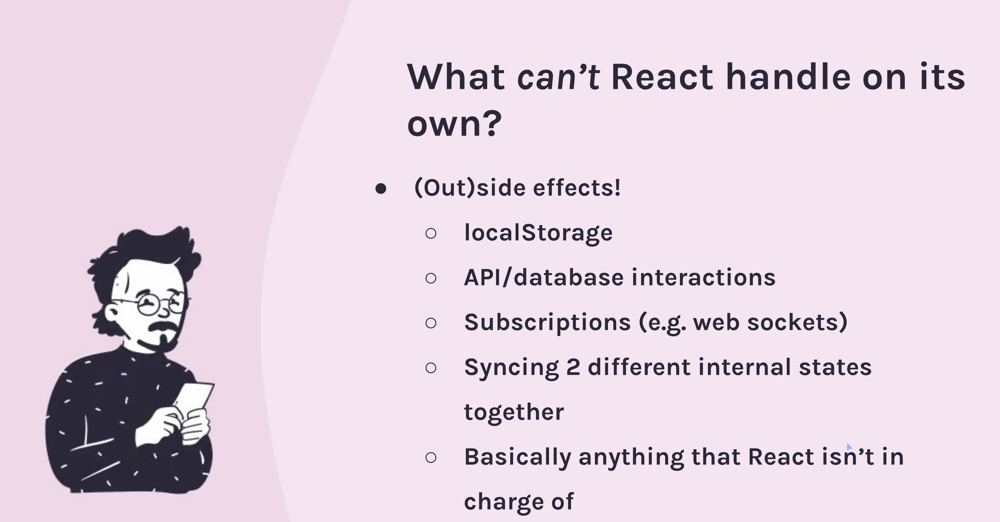

```js
import React from "react"

export default function App() {
    const [starWarsData, setStarWarsData] = React.useState({})
    
    console.log("Component rendered")
    
        
    // side effects
    React.useEffect(function() {
        fetch("https://swapi.dev/api/people/1")
            .then(res => res.json())
            // .then(data => setStarWarsData(data))
    }, ???)
    
    return (
        <div>
            <pre>{JSON.stringify(starWarsData, null, 2)}</pre>
        </div>
    )
}
```

```js
    // side effects
    React.useEffect(function() {
        console.log("Effect ran")
        // fetch("https://swapi.dev/api/people/1")
        //     .then(res => res.json())
        //     .then(data => console.log(data))
    }, [count])  // [0] compared to [0]
```

In React, `useEffect` is a hook that allows you to perform side effects in your component. Side effects are any actions that affect the outside world, such as fetching data from an API, updating the document title, or setting up an event listener.

`useEffect` takes two arguments: a function that will perform the side effect, and an array of dependencies that the effect depends on. Here's an example of a simple `useEffect` hook that will run once when the component mounts:

```js
import React, { useEffect } from 'react';

function MyComponent() {
  useEffect(() => {
    console.log('Mounted!');
  }, []);

  return <div>Hello, World!</div>;
}
```
In this example, we're logging a message to the console when the component mounts. The second argument to `useEffect` is an empty array, which means that the effect doesn't depend on any values from the component's state or props. This is a common pattern for effects that only need to run once when the component mounts.

If you want the effect to run every time a certain value changes, you can add that value to the array of dependencies. Here's an example that logs the count every time it changes:

```js
import React, { useState, useEffect } from 'react';

function MyComponent() {
  const [count, setCount] = useState(0);

  useEffect(() => {
    console.log(`Count: ${count}`);
  }, [count]);

  return (
    <div>
      <button onClick={() => setCount(count + 1)}>Increment</button>
    </div>
  );
}
```

In this example, we're logging the count to the console every time it changes. We've added count to the array of dependencies, which means that the effect will run every time the count changes.

`useEffect` is a powerful tool for performing side effects in your React components. By using useEffect correctly, you can ensure that your component remains performant and doesn't introduce any unexpected behavior.